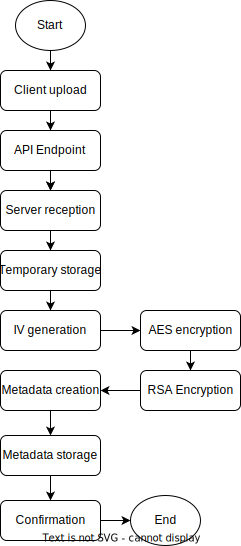

# Secure-File-Sharing File Upload Flow

1. **Client Initiates Upload**:
   - The user selects a file for upload.
   - Optional settings are chosen (e.g., expiration time, maximum downloads).

2. **Pre-Upload Processing (Optional)**:
   - File is encrypted client-side (if applicable).
   - Metadata is prepared (e.g., file name, size, type).

3. **Send Upload Request**:
   - The client sends an HTTP request to the server's upload endpoint, including the file and metadata.

4. **Server Receives Request**:
   - The server receives the upload request and validates the data (e.g., file size limits, user authentication).

5. **Server-Side Encryption (Optional)**:
   - If client-side encryption is not used, the server encrypts the file using AES or another suitable method.

6. **Store File**:
   - The encrypted file is saved to the server's file system or cloud storage.
   - The file path and other details are recorded.

7. **Create File Metadata Record**:
   - A new record is created in the database with file metadata (e.g., file path, encryption key, expiration time).
   - The repository and service layers handle the database interactions.

8. **Handle Response**:
   - Upon successful upload and storage, the server sends a response to the client with relevant information (e.g., download link, file ID).
   - Any errors are handled and communicated to the client.

9. **Client Receives Response**:
   - The client receives the server's response and updates the UI accordingly (e.g., displaying a success message, download link).
   - Errors are displayed to the user if applicable.

10. **Post-Upload Actions (Optional)**:
    - Additional actions such as logging, notifications, or other integrations may occur after a successful upload.

## File Upload Flowchart

The following flowchart illustrates the file upload and encryption process in detail:

## File Upload Flowchart Description

1. **Start**: Initiation of the file upload process.
2. **Client Upload**: User selects a file and initiates upload via the client interface.
3. **API Endpoint**: File hits the `POST /api/upload` endpoint.
4. **Server Reception**: Server receives the file and validates it.
5. **Temporary Storage**: File is temporarily stored on the server.
6. **IV Generation**: Generate a random Initialization Vector (IV) for AES encryption.
7. **AES Encryption**: File is encrypted using AES-256 in CBC mode.
8. **RSA Encryption**: The AES key is encrypted using RSA-OAEP with SHA-256.
9. **Encrypted File Storage**: Encrypted file is moved to the `files` directory.
10. **Metadata Creation**: Create a FileMetadata object.
11. **Metadata Storage**: FileMetadata object is stored in MongoDB database.
12. **Confirmation**: Server sends a confirmation response to the client.
13. **End**: End of the file upload process.
